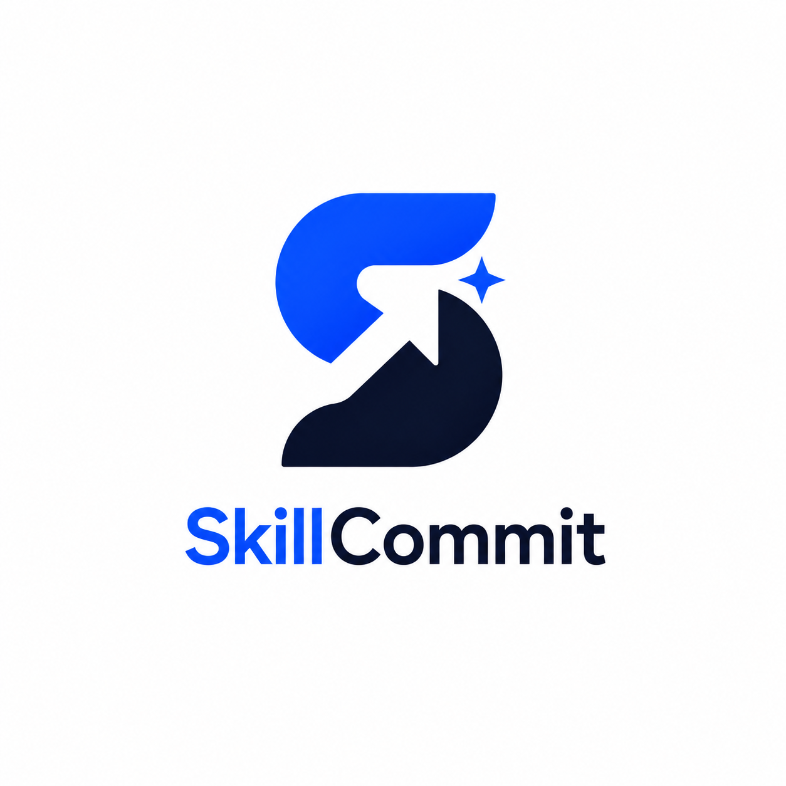
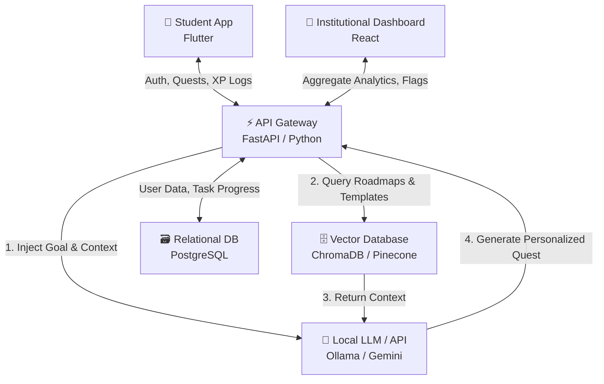

<div align="center">
  

  <h1>SkillCommit 🚀</h1>

  <p>
    <i>Level up your career, one commit at a time. An AI-powered, gamified career GPS for students.</i>
  </p>

  <p>
    
    
    
    
    
  </p>
</div>

---

## 📖 Table of Contents

- [🚨 The Problem](#-the-problem-analysis-paralysis)
- [💡 The Solution](#-the-solution)
- [✨ Core Features](#-core-features)
- [🏗 System Architecture](#-system-architecture)
- [🧠 The AI Engine (RAG)](#-the-ai-engine-rag)
- [🛠️ Tech Stack](#️-tech-stack)
- [📂 Repository Structure](#-repository-structure)
- [🚀 Getting Started](#-getting-started)

---

## 🚨 The Problem: Analysis Paralysis

Engineering and technical students have immense potential and ambition, but face a massive hurdle: **Analysis Paralysis**. 

Generic advice like *"build a strong CV"* or *"learn data structures"* is abstract and overwhelming. Even capable students consistently ask: *"I want to improve and get a high-paying placement, but I don't know where to start, what to prioritize, or how to execute."* Static roadmaps become obsolete quickly, and colleges lack the tools to track daily professional development before placement season begins.

## 💡 The Solution

**SkillCommit** transforms career preparation into an engaging, structured, and personalized journey. By applying RPG gaming mechanics to professional development, the system triggers psychological reward loops. Combined with a dynamic AI (RAG) pipeline, it analyzes shifting industry trends and user profiles to assign hyper-personalized, atomic tasks ("Quests").

---

## ✨ Core Features

### 📱 B2C: The Student Experience (Mobile App)
* **Dynamic Character Build:** Conversational AI onboarding to establish the initial "Knowledge Graph" (skills, goals, academic standing).
* **The Quest Board:** AI-generated actionable tasks based on the delta between the student's current profile and their target career.
* **Gamified Progression:** Earn XP for completing tasks, unlock new "Skill Trees," and track your "Commit Streak."
* **Contextual 'How-To' Arsenal:** RAG-powered resources injected directly into quests (e.g., exact CV templates and tutorials needed for a specific task).

### 🏢 B2B: The Institutional Portal (Web Dashboard)
* **Cohort Skill Mapping:** Real-time visualization of aggregate skill levels across an entire batch.
* **Intervention Flags:** Identify highly capable students who are bottlenecked by specific, easily resolvable issues months before recruiters arrive.
* **Placement Probability Tracking:** Align student progress with live industry demands.

---

## 🏗 System Architecture

The architecture is fully decoupled, utilizing asynchronous data streaming to handle gamification logs, AI generation, and dashboard analytics simultaneously.



---

## 🧠 The AI Engine (RAG)

SkillCommit does not rely on static LLM wrappers. It utilizes a **Retrieval-Augmented Generation (RAG)** pipeline to ensure accuracy and relevance:
1. **The Vector Database** stores industry-standard career roadmaps, verified CV frameworks, and up-to-date tech skill requirements.
2. When the system evaluates a student, the LLM retrieves these verified frameworks and merges them with the student's personal Knowledge Graph.
3. This prevents "hallucinations" and ensures that if the tech industry shifts, the vector database can be updated, instantly generating new, relevant quests for the student body.

---

## 🛠️ Tech Stack

| Domain | Technology |
|---|---|
| **Frontend (Mobile)** | Flutter, Dart (Cross-platform iOS/Android) |
| **Frontend (Web Dashboard)** | React.js, Tailwind CSS |
| **Backend** | Python, FastAPI (Asynchronous endpoints for LLM streaming) |
| **AI/Machine Learning** | Ollama (Local development), Retrieval-Augmented Generation (RAG) |
| **Databases** | PostgreSQL (User data/XP), Vector DB (ChromaDB/Pinecone for knowledge embeddings) |
| **Environment** | Docker, Kali Linux (System admin & local R&D) |

---

## 📂 Repository Structure

SkillCommit follows a highly modular, professional monorepo architecture. This isolates the AI engine, the mobile client, and the institutional web portal for clean, scalable development.

```text
SkillCommit/
├── .github/                 # CI/CD pipelines & automated Issue templates
├── backend/                 # FastAPI Server & AI RAG Engine
│   ├── app/                 # Core application logic
│   │   ├── api/             # API routing and endpoints
│   │   ├── core/            # Database connection & security configs
│   │   ├── models/          # SQLAlchemy database schemas (PostgreSQL)
│   │   └── services/        # AI logic, RAG pipeline, & ChromaDB integration
│   ├── Dockerfile           # Production containerization blueprint
│   └── requirements.txt     # Python dependencies
├── dashboard/               # Institutional web portal (React/Next.js)
├── Docs/                    # Project reports and architectural decisions (ADRs)
├── frontend/                # Student mobile application (Flutter)
├── scripts/                 # Automation, database migration, and deployment scripts
├── .env.example             # Global environment variables template
├── .gitignore               # Ignored files and security exclusions
└── README.md                # Project documentation
```

---

## 🚀 Getting Started

> **Note:** Detailed setup instructions and folder structures will be added as the repository is populated during the initial development phases.

### Prerequisites

* Python 3.10+
* Flutter SDK
* Node.js (for React Dashboard)
* Local LLM environment (e.g., Ollama installed and running)

---

<div align="center">
  <i>Built with 💡 to bridge the gap between academic potential and industry reality.</i>
</div>